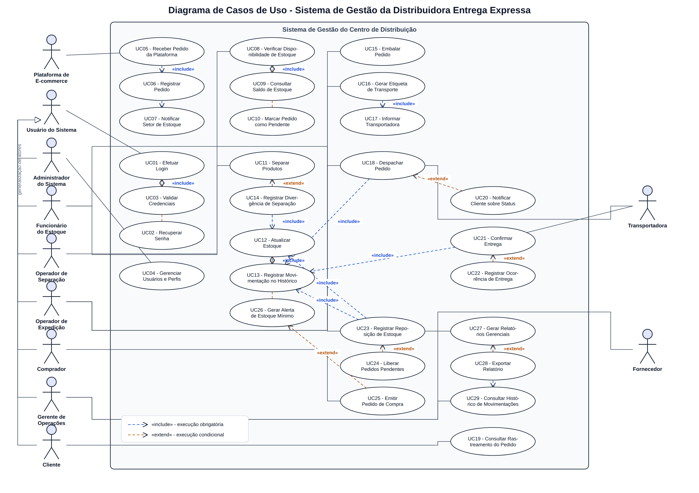
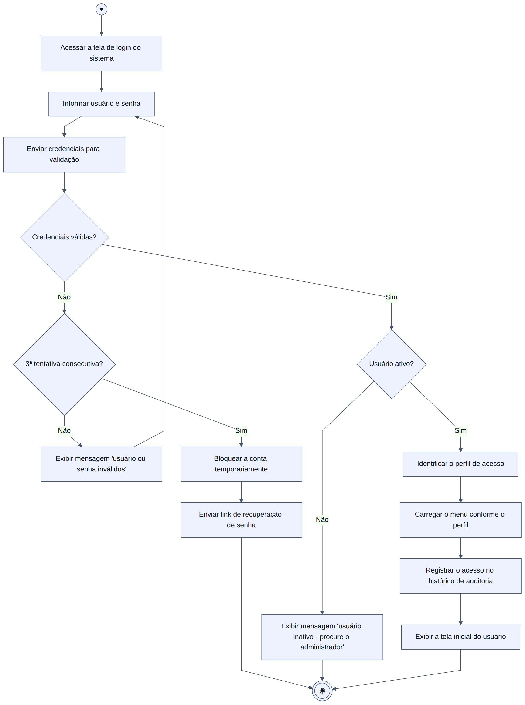
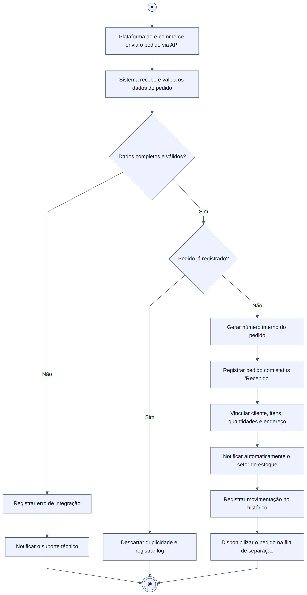
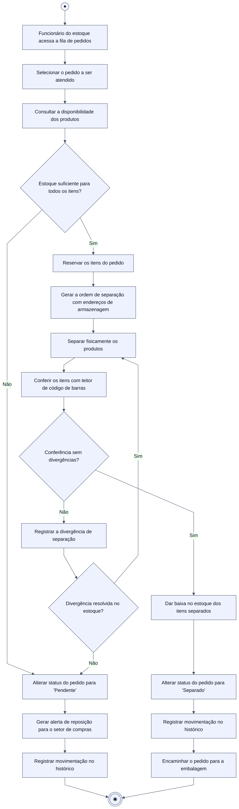
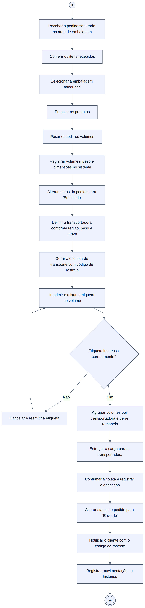
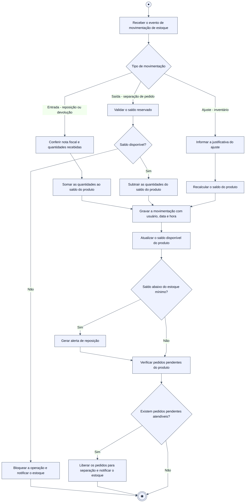
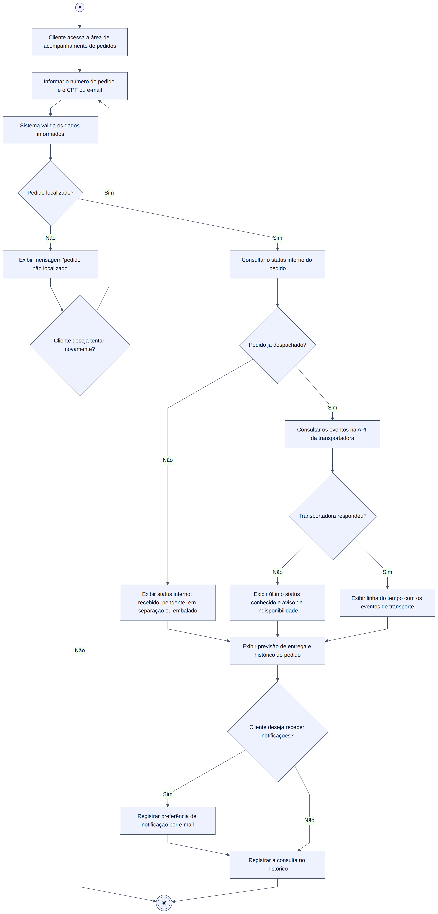
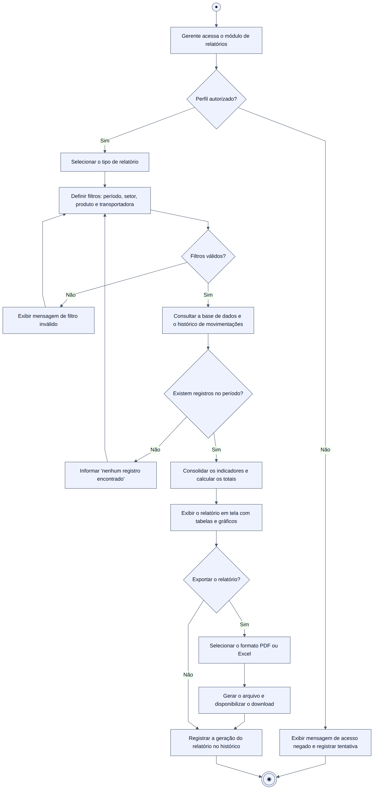
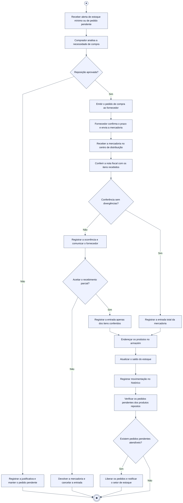

# Entrega Expressa — Sistema de Gestão de uma Distribuidora de E-commerce

Estudo de caso de Engenharia de Software: levantamento de requisitos, diagrama de casos de uso (UML)
e diagramas de atividades do sistema integrado do centro de distribuição da empresa **Entrega Expressa**.

| | |
|---|---|
| **Documento** | Análise e modelagem do sistema |
| **Empresa (estudo de caso)** | Entrega Expressa — distribuidora de e-commerce |
| **Notação** | UML 2.x (casos de uso e atividades) |
| **Conteúdo** | 25 requisitos funcionais, 15 não funcionais, 11 atores, 29 casos de uso, 8 diagramas de atividades |
| **Entrega** | [`Entrega-Expressa-Estudo-de-Caso.docx`](Entrega-Expressa-Estudo-de-Caso.docx) — documento acadêmico com capa, folha de rosto, sumário e todos os diagramas |

---

## Sumário

1. [Introdução](#1-introdução)
2. [Regras de negócio](#2-regras-de-negócio)
3. [Requisitos funcionais](#3-requisitos-funcionais)
4. [Requisitos não funcionais](#4-requisitos-não-funcionais)
5. [Atores do sistema](#5-atores-do-sistema)
6. [Diagrama de casos de uso](#6-diagrama-de-casos-de-uso)
7. [Diagramas de atividades](#7-diagramas-de-atividades)
8. [Matriz de rastreabilidade](#8-matriz-de-rastreabilidade)
9. [Como regerar os diagramas](#9-como-regerar-os-diagramas)

---

## 1. Introdução

A **Entrega Expressa** é uma distribuidora responsável pelo armazenamento e pela distribuição de produtos
vendidos em plataformas de comércio eletrônico como Mercado Livre, Shopee e lojas virtuais parceiras.
Hoje boa parte da operação é conduzida manualmente: os pedidos chegam por planilhas e e-mails, a conferência
de estoque depende da memória dos funcionários e o acompanhamento do pedido é feito por telefone. O resultado
são atrasos, erros de separação, rupturas de estoque não percebidas a tempo e retrabalho na expedição.

O sistema proposto integra, em uma única base de dados, todo o ciclo do pedido dentro do centro de distribuição:
**recebimento automático do pedido → verificação e reserva de estoque → separação → embalagem → expedição →
transporte → confirmação da entrega**, mantendo o histórico de todas as movimentações e oferecendo ao cliente
o acompanhamento do status em tempo real.

**Objetivos do sistema**

- Eliminar o registro manual de pedidos por meio da integração com as plataformas de venda.
- Garantir controle de saldo de estoque confiável, com reserva de itens e bloqueio de saldo negativo.
- Padronizar a separação, a embalagem e a expedição, reduzindo erros de envio.
- Dar visibilidade do status do pedido ao cliente e à gerência.
- Manter histórico auditável de todas as movimentações para apuração de responsabilidades e indicadores.

**Fora do escopo**: emissão de nota fiscal, faturamento, folha de pagamento e gestão financeira, que
permanecem no ERP atual e serão apenas consultados por integração futura.

---

## 2. Regras de negócio

| Código | Regra |
|---|---|
| RN01 | Um pedido só entra em separação quando **todos** os itens tiverem saldo disponível; caso contrário fica com status `Pendente`. |
| RN02 | A verificação de disponibilidade **reserva** os itens do pedido, tornando-os indisponíveis para outros pedidos. |
| RN03 | A baixa definitiva do estoque ocorre na conclusão da separação, e não na reserva. |
| RN04 | Pedidos pendentes são liberados automaticamente, por ordem de data de recebimento, assim que houver reposição. |
| RN05 | Nenhuma operação pode deixar o saldo de um produto negativo. |
| RN06 | Todo pedido segue os status: `Recebido` → `Pendente` (opcional) → `Em separação` → `Separado` → `Embalado` → `Enviado` → `Entregue`. |
| RN07 | A etiqueta de transporte só é gerada após o registro dos volumes (peso e dimensões). |
| RN08 | A transportadora é definida por regra de região de entrega, peso/volume e prazo contratado. |
| RN09 | Toda alteração de status ou de saldo gera um registro no histórico com usuário, data e hora. |
| RN10 | O cliente consulta apenas os pedidos vinculados ao seu CPF/e-mail. |
| RN11 | Produtos com saldo igual ou inferior ao estoque mínimo geram alerta automático de reposição. |
| RN12 | Divergências de separação ou de recebimento devem ser registradas antes de qualquer ajuste de saldo. |

---

## 3. Requisitos funcionais

| Código | Requisito | Descrição | Ator principal | Prioridade |
|---|---|---|---|---|
| RF01 | Integrar-se às plataformas de venda | Receber os pedidos de Mercado Livre, Shopee e lojas parceiras por API/webhook, sem digitação manual. | Plataforma de E-commerce | Alta |
| RF02 | Registrar pedido | Gravar número interno, cliente, itens, quantidades, endereço de entrega, prazo e plataforma de origem. | Sistema | Alta |
| RF03 | Notificar o setor de estoque | Avisar automaticamente o estoque a cada novo pedido registrado e exibi-lo na fila de separação. | Sistema | Alta |
| RF04 | Verificar disponibilidade de produtos | Conferir o saldo de cada item do pedido e reservar as quantidades disponíveis. | Funcionário do Estoque | Alta |
| RF05 | Tratar pedido sem estoque | Classificar o pedido como `Pendente` e gerar alerta de reposição quando faltar saldo. | Sistema | Alta |
| RF06 | Liberar pedidos pendentes | Reprocessar automaticamente os pedidos pendentes após a entrada de mercadoria. | Sistema | Alta |
| RF07 | Gerar ordem de separação | Emitir a lista de picking com produto, quantidade e endereço de armazenagem. | Funcionário do Estoque | Alta |
| RF08 | Conferir a separação | Registrar a leitura dos itens por código de barras e apontar divergências. | Operador de Separação | Alta |
| RF09 | Dar baixa no estoque | Descontar as quantidades separadas do saldo, de forma transacional. | Sistema | Alta |
| RF10 | Registrar a embalagem | Informar quantidade de volumes, peso e dimensões de cada volume do pedido. | Operador de Expedição | Alta |
| RF11 | Gerar etiqueta de transporte | Emitir a etiqueta com código de rastreio, dados do destinatário e da transportadora. | Operador de Expedição | Alta |
| RF12 | Definir a transportadora | Sugerir/selecionar a transportadora conforme região, peso e prazo, permitindo troca manual justificada. | Operador de Expedição | Média |
| RF13 | Registrar o despacho | Confirmar a coleta pela transportadora e gerar o romaneio de carga. | Operador de Expedição | Alta |
| RF14 | Consultar rastreamento | Permitir ao cliente consultar status e eventos de transporte pelo número do pedido. | Cliente | Alta |
| RF15 | Notificar o cliente | Enviar e-mail a cada mudança de status do pedido, incluindo o código de rastreio. | Sistema | Média |
| RF16 | Confirmar entrega | Permitir que a transportadora informe a conclusão da entrega e registre ocorrências (ausente, recusa, avaria). | Transportadora | Alta |
| RF17 | Manter histórico de movimentações | Registrar toda operação (usuário, data, hora, ação, pedido/produto) de forma consultável. | Sistema | Alta |
| RF18 | Controlar o estoque | Manter entradas, saídas, ajustes, saldo atual, saldo reservado e estoque mínimo por produto. | Funcionário do Estoque | Alta |
| RF19 | Emitir alerta de estoque mínimo | Avisar o setor de compras quando o saldo atingir o ponto de reposição. | Sistema | Média |
| RF20 | Registrar entrada de mercadoria | Conferir a nota fiscal do fornecedor, registrar a entrada e endereçar os produtos. | Funcionário do Estoque | Alta |
| RF21 | Emitir pedido de compra | Gerar e enviar o pedido de reposição ao fornecedor a partir do alerta de estoque mínimo. | Comprador | Média |
| RF22 | Gerar relatórios gerenciais | Emitir relatórios de pedidos por período, produtividade da separação, pedidos pendentes, giro de estoque e desempenho das transportadoras. | Gerente de Operações | Média |
| RF23 | Exportar relatórios | Exportar os relatórios gerados em PDF e Excel. | Gerente de Operações | Baixa |
| RF24 | Autenticar usuários | Controlar o acesso por login e senha, com recuperação de senha e bloqueio após tentativas inválidas. | Usuário do Sistema | Alta |
| RF25 | Gerenciar usuários, perfis e cadastros | Manter usuários, perfis de acesso, produtos, fornecedores e transportadoras. | Administrador do Sistema | Alta |

---

## 4. Requisitos não funcionais

| Código | Categoria | Requisito |
|---|---|---|
| RNF01 | Usabilidade | Interface web responsiva, em português (pt-BR), utilizável em desktop e coletores de dados do armazém. |
| RNF02 | Desempenho | Consultas de pedido e de saldo devem responder em até 3 segundos em condições normais de uso. |
| RNF03 | Desempenho | Pedidos recebidos das plataformas devem ser registrados em até 1 minuto após o envio. |
| RNF04 | Disponibilidade | Disponibilidade mínima de 99,5% ao mês, com manutenções programadas fora do horário de pico. |
| RNF05 | Escalabilidade | Suportar 200 usuários simultâneos e o processamento de até 10.000 pedidos por dia. |
| RNF06 | Segurança | Comunicação obrigatoriamente em HTTPS/TLS e senhas armazenadas com hash e salt. |
| RNF07 | Segurança | Acesso controlado por perfil (estoque, separação, expedição, compras, gerência, administrador e cliente). |
| RNF08 | Auditoria | O histórico de movimentações não pode ser alterado ou excluído e deve ser retido por, no mínimo, 5 anos. |
| RNF09 | Confiabilidade | As atualizações de saldo devem ser transacionais e à prova de concorrência, impedindo saldo negativo. |
| RNF10 | Backup | Backup automático diário, com RPO de 1 hora e RTO de 4 horas. |
| RNF11 | Integração | Integração via API REST/JSON com plataformas de venda e transportadoras, com reprocessamento em caso de falha. |
| RNF12 | Compatibilidade | Etiquetas no padrão 10x15 cm compatíveis com impressoras térmicas (ZPL) e leitura por código de barras. |
| RNF13 | Legal | Tratamento de dados pessoais dos clientes em conformidade com a LGPD (Lei 13.709/2018). |
| RNF14 | Manutenibilidade | Arquitetura em camadas, código versionado em Git e documentação técnica atualizada a cada release. |
| RNF15 | Portabilidade | Executar nos navegadores Chrome, Edge e Firefox em suas duas últimas versões, sem instalação local. |

---

## 5. Atores do sistema

| Ator | Tipo | Responsabilidade no sistema |
|---|---|---|
| **Usuário do Sistema** | Ator generalizado | Ator abstrato que representa todo usuário autenticado; concentra o caso de uso de login. |
| **Plataforma de E-commerce** | Externo (sistema) | Envia os pedidos de venda (Mercado Livre, Shopee, lojas parceiras). |
| **Cliente** | Primário | Acompanha o status e o rastreamento do seu pedido. |
| **Funcionário do Estoque** | Primário | Verifica disponibilidade, controla saldos e registra a entrada de mercadorias. |
| **Operador de Separação** | Primário | Executa e confere a separação (picking) dos produtos do pedido. |
| **Operador de Expedição** | Primário | Embala, gera etiqueta, define transportadora e despacha os pedidos. |
| **Comprador** | Primário | Analisa os alertas de estoque mínimo e emite os pedidos de compra. |
| **Gerente de Operações** | Primário | Acompanha indicadores, gera relatórios gerenciais e consulta o histórico. |
| **Administrador do Sistema** | Primário | Gerencia usuários, perfis de acesso e cadastros básicos. |
| **Transportadora** | Externo | Recebe a carga, informa eventos de transporte e confirma a entrega. |
| **Fornecedor** | Externo | Atende aos pedidos de compra e entrega a mercadoria no centro de distribuição. |

---

## 6. Diagrama de casos de uso



> Arquivo vetorial: [`img/00-casos-de-uso.svg`](img/00-casos-de-uso.svg) · fonte: [`scripts/gerar_casos_de_uso.py`](scripts/gerar_casos_de_uso.py)
> · versão alternativa em Mermaid: [`diagramas/00-casos-de-uso.mmd`](diagramas/00-casos-de-uso.mmd)

### 6.1 Casos de uso

| Código | Caso de uso | Ator | Requisitos atendidos |
|---|---|---|---|
| UC01 | Efetuar Login | Usuário do Sistema | RF24 |
| UC02 | Recuperar Senha | Usuário do Sistema | RF24 |
| UC03 | Validar Credenciais | — (interno) | RF24 |
| UC04 | Gerenciar Usuários e Perfis | Administrador do Sistema | RF25 |
| UC05 | Receber Pedido da Plataforma | Plataforma de E-commerce | RF01 |
| UC06 | Registrar Pedido | — (interno) | RF02 |
| UC07 | Notificar Setor de Estoque | — (interno) | RF03 |
| UC08 | Verificar Disponibilidade de Estoque | Funcionário do Estoque | RF04 |
| UC09 | Consultar Saldo de Estoque | — (interno) | RF18 |
| UC10 | Marcar Pedido como Pendente | — (interno) | RF05 |
| UC11 | Separar Produtos | Operador de Separação | RF07, RF08 |
| UC12 | Atualizar Estoque | — (interno) | RF09, RF18 |
| UC13 | Registrar Movimentação no Histórico | — (interno) | RF17 |
| UC14 | Registrar Divergência de Separação | Operador de Separação | RF08 |
| UC15 | Embalar Pedido | Operador de Expedição | RF10 |
| UC16 | Gerar Etiqueta de Transporte | Operador de Expedição | RF11 |
| UC17 | Informar Transportadora | — (interno) | RF12 |
| UC18 | Despachar Pedido | Operador de Expedição / Transportadora | RF13 |
| UC19 | Consultar Rastreamento do Pedido | Cliente | RF14 |
| UC20 | Notificar Cliente sobre Status | — (interno) | RF15 |
| UC21 | Confirmar Entrega | Transportadora | RF16 |
| UC22 | Registrar Ocorrência de Entrega | Transportadora | RF16 |
| UC23 | Registrar Reposição de Estoque | Funcionário do Estoque / Fornecedor | RF20 |
| UC24 | Liberar Pedidos Pendentes | — (interno) | RF06 |
| UC25 | Emitir Pedido de Compra | Comprador | RF21 |
| UC26 | Gerar Alerta de Estoque Mínimo | — (interno) | RF19 |
| UC27 | Gerar Relatórios Gerenciais | Gerente de Operações | RF22 |
| UC28 | Exportar Relatório | Gerente de Operações | RF23 |
| UC29 | Consultar Histórico de Movimentações | Gerente de Operações | RF17 |

### 6.2 Relacionamentos «include» — execução obrigatória

| Caso de uso base | «include» | Por que é obrigatório |
|---|---|---|
| UC01 Efetuar Login | UC03 Validar Credenciais | Não existe login sem a validação das credenciais. |
| UC05 Receber Pedido da Plataforma | UC06 Registrar Pedido | Todo pedido recebido é obrigatoriamente gravado no sistema. |
| UC05 Receber Pedido da Plataforma | UC07 Notificar Setor de Estoque | O estoque é sempre avisado do novo pedido. |
| UC08 Verificar Disponibilidade | UC09 Consultar Saldo de Estoque | A verificação sempre consulta o saldo dos produtos. |
| UC11 Separar Produtos | UC12 Atualizar Estoque | A separação sempre gera a baixa das quantidades. |
| UC11 Separar Produtos | UC13 Registrar Movimentação | Toda separação é gravada no histórico. |
| UC12 Atualizar Estoque | UC13 Registrar Movimentação | Toda alteração de saldo é registrada. |
| UC16 Gerar Etiqueta de Transporte | UC17 Informar Transportadora | A etiqueta só existe vinculada a uma transportadora. |
| UC18 Despachar Pedido | UC13 Registrar Movimentação | O despacho sempre alimenta o histórico. |
| UC21 Confirmar Entrega | UC13 Registrar Movimentação | A conclusão da entrega sempre é registrada. |
| UC23 Registrar Reposição de Estoque | UC12 Atualizar Estoque | A entrada de mercadoria sempre soma saldo. |
| UC23 Registrar Reposição de Estoque | UC13 Registrar Movimentação | A entrada sempre é gravada no histórico. |
| UC27 Gerar Relatórios Gerenciais | UC29 Consultar Histórico | Os relatórios são construídos a partir do histórico. |

### 6.3 Relacionamentos «extend» — execução condicional

| Caso de uso estendido | «extend» | Condição |
|---|---|---|
| UC01 Efetuar Login | UC02 Recuperar Senha | Somente quando o usuário esquece a senha ou é bloqueado. |
| UC08 Verificar Disponibilidade | UC10 Marcar Pedido como Pendente | Somente quando falta saldo para algum item. |
| UC11 Separar Produtos | UC14 Registrar Divergência | Somente quando a conferência aponta diferença. |
| UC12 Atualizar Estoque | UC26 Gerar Alerta de Estoque Mínimo | Somente quando o saldo fica igual/abaixo do mínimo. |
| UC18 Despachar Pedido | UC20 Notificar Cliente sobre Status | Somente quando o cliente possui contato válido cadastrado. |
| UC21 Confirmar Entrega | UC22 Registrar Ocorrência de Entrega | Somente quando há insucesso, avaria ou recusa. |
| UC23 Registrar Reposição | UC24 Liberar Pedidos Pendentes | Somente quando existem pedidos pendentes daquele produto. |
| UC26 Gerar Alerta de Estoque Mínimo | UC25 Emitir Pedido de Compra | Somente quando o comprador aprova a reposição. |
| UC27 Gerar Relatórios Gerenciais | UC28 Exportar Relatório | Somente quando o gerente opta por exportar o resultado. |

### 6.4 Generalização de atores

Cliente, Funcionário do Estoque, Operador de Separação, Operador de Expedição, Comprador,
Gerente de Operações e Administrador do Sistema são **especializações** do ator *Usuário do Sistema*.
Com isso, o caso de uso **UC01 - Efetuar Login** é associado uma única vez ao ator generalizado,
e não repetido para cada perfil.

---

## 7. Diagramas de atividades

Cada diagrama segue a notação UML: nó inicial (●), ações (retângulos arredondados), nós de decisão
(losangos) com guardas `[condição]` e nó final (◉). As fontes em Mermaid estão em
[`diagramas/`](diagramas) e as imagens em [`img/`](img).

### 7.1 Processo de Login

Autenticação de qualquer usuário, com tratamento de credenciais inválidas, bloqueio após três tentativas
e carregamento do menu conforme o perfil. Implementa UC01/UC02/UC03 (RF24).



### 7.2 Recebimento de Pedido

Chegada do pedido pela plataforma de venda, validação dos dados, tratamento de duplicidade, registro com
status `Recebido` e notificação automática do setor de estoque. Implementa UC05/UC06/UC07 (RF01, RF02, RF03).



### 7.3 Separação de Produtos

Verificação de disponibilidade, reserva dos itens, geração da ordem de separação, conferência por código
de barras, tratamento de divergências e baixa de estoque. Quando falta saldo, o pedido passa a `Pendente`
e gera alerta de reposição. Implementa UC08/UC10/UC11/UC12/UC14 (RF04, RF05, RF07, RF08, RF09).



### 7.4 Embalagem e Expedição

Conferência do pedido separado, embalagem, registro de volumes e peso, definição da transportadora,
emissão e impressão da etiqueta, romaneio, coleta e mudança do status para `Enviado` com notificação
ao cliente. Implementa UC15/UC16/UC17/UC18/UC20 (RF10, RF11, RF12, RF13, RF15).



### 7.5 Atualização de Estoque

Fluxo comum a todos os tipos de movimentação — entrada, saída e ajuste de inventário — com validação de
saldo, gravação no histórico, alerta de estoque mínimo e liberação de pedidos pendentes.
Implementa UC12/UC13/UC24/UC26 (RF06, RF09, RF17, RF18, RF19).



### 7.6 Consulta de Rastreamento pelo Cliente

Consulta do cliente pelo número do pedido, exibição do status interno ou dos eventos obtidos junto à
transportadora, tratamento de indisponibilidade da API e cadastro de preferência de notificação.
Implementa UC19/UC20 (RF14, RF15).



### 7.7 Geração de Relatórios Gerenciais

Verificação de perfil, escolha do tipo de relatório, aplicação de filtros, consolidação dos indicadores a
partir do histórico, exibição em tela e exportação opcional em PDF/Excel.
Implementa UC27/UC28/UC29 (RF17, RF22, RF23).



### 7.8 Reposição de Estoque

Da geração do alerta de estoque mínimo até a entrada da mercadoria: análise do comprador, pedido de compra,
recebimento e conferência da nota fiscal, tratamento de divergências, endereçamento, atualização de saldo e
liberação dos pedidos que estavam pendentes. Implementa UC23/UC24/UC25/UC26 (RF06, RF19, RF20, RF21).



---

## 8. Matriz de rastreabilidade

| Requisito | Casos de uso | Diagrama de atividades |
|---|---|---|
| RF01, RF02, RF03 | UC05, UC06, UC07 | 7.2 Recebimento de Pedido |
| RF04, RF05 | UC08, UC09, UC10 | 7.3 Separação de Produtos |
| RF06 | UC24 | 7.5 Atualização de Estoque · 7.8 Reposição de Estoque |
| RF07, RF08 | UC11, UC14 | 7.3 Separação de Produtos |
| RF09, RF18 | UC12 | 7.3 Separação de Produtos · 7.5 Atualização de Estoque |
| RF10, RF11, RF12, RF13 | UC15, UC16, UC17, UC18 | 7.4 Embalagem e Expedição |
| RF14 | UC19 | 7.6 Consulta de Rastreamento |
| RF15 | UC20 | 7.4 Embalagem e Expedição · 7.6 Consulta de Rastreamento |
| RF16 | UC21, UC22 | 7.4 Embalagem e Expedição |
| RF17 | UC13, UC29 | Todos os diagramas (registro no histórico) |
| RF19 | UC26 | 7.5 Atualização de Estoque · 7.8 Reposição de Estoque |
| RF20, RF21 | UC23, UC25 | 7.8 Reposição de Estoque |
| RF22, RF23 | UC27, UC28 | 7.7 Geração de Relatórios Gerenciais |
| RF24 | UC01, UC02, UC03 | 7.1 Processo de Login |
| RF25 | UC04 | — (manutenção de cadastros) |

---

## 9. Como regerar os diagramas

Os diagramas de atividades são gerados a partir dos arquivos Mermaid (`diagramas/*.mmd`) e o diagrama de
casos de uso a partir do script Python (`scripts/gerar_casos_de_uso.py`).

```bash
# documento acadêmico (.docx)
npm install docx
node docs/entrega-expressa/scripts/gerar_documento_docx.cjs

# diagrama de casos de uso (SVG)
python3 docs/entrega-expressa/scripts/gerar_casos_de_uso.py

# diagramas de atividades (PNG) — requer o mermaid-cli
npm install -g @mermaid-js/mermaid-cli
cd docs/entrega-expressa
for f in diagramas/*.mmd; do
  mmdc -i "$f" -o "img/$(basename "$f" .mmd).png" -b white -s 2   # versão PNG
  mmdc -i "$f" -o "img/$(basename "$f" .mmd).svg" -b transparent  # versão vetorial
done
```

> Ao abrir o `.docx` no Word, atualize o sumário (`Ctrl+A` e depois `F9`) para gerar a paginação.
> Os diagramas também estão disponíveis em SVG na pasta `img/`, para inserção em outros documentos
> sem perda de qualidade.

### Estrutura dos arquivos

```
docs/entrega-expressa/
├── README.md                    # este documento
├── diagramas/                   # fontes Mermaid (.mmd)
│   ├── 00-casos-de-uso.mmd
│   ├── 01-login.mmd
│   ├── 02-recebimento-pedido.mmd
│   ├── 03-separacao-produtos.mmd
│   ├── 04-embalagem-expedicao.mmd
│   ├── 05-atualizacao-estoque.mmd
│   ├── 06-rastreamento-cliente.mmd
│   ├── 07-relatorios-gerenciais.mmd
│   └── 08-reposicao-estoque.mmd
├── img/                         # diagramas renderizados (PNG e SVG)
├── scripts/
│   ├── gerar_casos_de_uso.py    # gera o diagrama de casos de uso em SVG
│   └── gerar_documento_docx.cjs # gera o documento acadêmico em .docx
└── Entrega-Expressa-Estudo-de-Caso.docx
```
